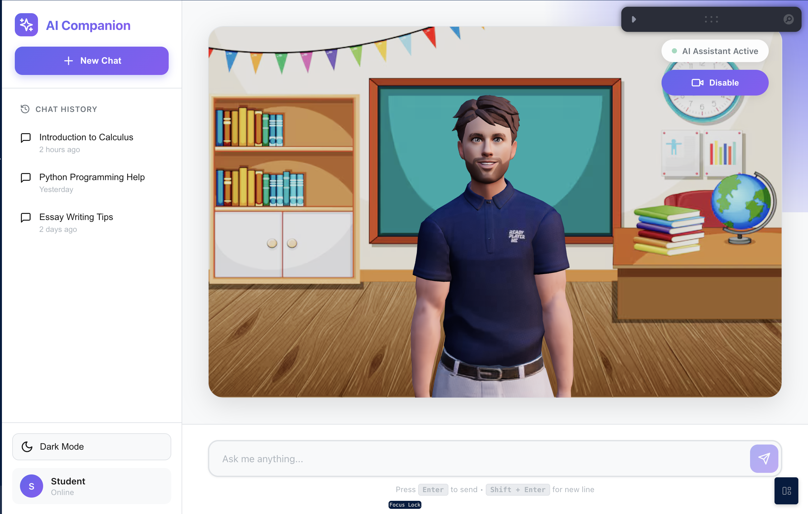

# AI Avatar Companion - Interactive Learning Platform

An interactive web application featuring a 3D AI avatar with VISEME-based lip synchronization. The application provides an educational AI companion powered by Google Gemini API with natural conversation capabilities and synchronized facial animations.

## Demo Screenshot



## Key Features

- Gemini AI Integration - Powered by Google Gemini API for intelligent responses
- Real-time Chat Interface - Interactive conversation with AI companion
- VISEME-based Lip Synchronization - Mouth animation synchronized with audio playback
- 3D Avatar Rendering - ReadyPlayerMe avatar rendered with Three.js
- Dark/Light Theme - Persistent theme switching with localStorage
- Animation System - Greeting and idle animations with smooth transitions
- Audio Processing Tool - Generate VISEME data from audio files
- High Performance Rendering - 60 FPS 3D rendering

## Technology Stack

**Frontend**

- React 18
- Three.js & React Three Fiber
- @react-three/drei
- Vite (Build Tool)
- Leva (Debug Controls)
- Lucide React (Icons)

**Backend**

- Google Gemini API (AI Chat)
- Deployed Backend URL: `https://cyphers101.onrender.com/api/chat`
- Express.js (Server Framework)

**Audio Processing**

- wawa-lipsync (VISEME generation)
- Web Audio API

**3D Assets**

- ReadyPlayerMe Avatar (GLB format)
- FBX Animations (Idle, Greeting)
- VISEME morph targets

## Project Structure

```
Ai-companion/
├── frontend/                        # Main React Application
│   ├── src/
│   │   ├── components/
│   │   │   ├── Avatar.jsx           # 3D avatar with VISEME lip-sync
│   │   │   ├── Experience.jsx       # Three.js scene setup
│   │   │   ├── Sidebar.jsx          # Chat history sidebar
│   │   │   ├── MainContent.jsx      # Main content area
│   │   │   ├── AvatarSection.jsx    # Avatar container with Canvas
│   │   │   └── ChatSection.jsx      # Chat input interface
│   │   ├── contexts/
│   │   │   └── ThemeContext.jsx     # Theme state management
│   │   ├── config/
│   │   │   └── api.js               # API endpoint configuration
│   │   ├── App.jsx                  # Main application component
│   │   ├── App.css
│   │   ├── index.css
│   │   └── main.jsx
│   ├── public/
│   │   ├── models/                  # GLB avatar files
│   │   ├── animations/              # FBX animation files
│   │   ├── audios/                  # Audio files with VISEME JSON data
│   │   └── textures/                # Background images
│   ├── index.html
│   ├── vite.config.js
│   └── package.json
│
├── tools/                           # Audio Processing Tools
│   ├── main.js                      # VISEME generator script
│   ├── index.html                   # Web interface for tool
│   ├── package.json
│   └── sample.mp3                   # Sample audio file
│
├── docs/                            # Project Documentation
│   ├── ARCHITECTURE.md              # Architecture overview
│   ├── API.md                       # API documentation
│   └── demo.png                     # Demo screenshot
│
├── chat-demo.html                   # Standalone chat demo (no 3D avatar)
├── SETUP.md                         # Detailed setup instructions
├── PROJECT_SUMMARY.md               # Project summary
├── GEMINI_API_INTEGRATION.md        # Gemini API integration guide
├── VISEME_FORMAT.md                 # VISEME format specification
└── README.md                        # This file
```

## Prerequisites

- Node.js 18 or higher
- npm (comes with Node.js)
- Modern web browser (Chrome, Firefox, Safari, or Edge)
- Internet connection (for Gemini API calls)

## Installation and Running

### 1. Main Application (Frontend with 3D Avatar)

This is the primary application featuring the 3D avatar with AI chat capabilities.

```bash
# Navigate to project root
cd Ai-companion

# Navigate to frontend directory
cd frontend

# Install dependencies
npm install

# Start development server
npm run dev
```

The application will be available at: **http://localhost:5173**

The frontend connects to the deployed backend at: `https://cyphers101.onrender.com/api/chat`

**Note:** First request to the backend may take 30-60 seconds due to cold start on free hosting.

### 2. Standalone Chat Demo (Without 3D Avatar)

A simple HTML file to test the Gemini API chat functionality without the 3D avatar.

```bash
# From project root
cd Ai-companion

# Open in browser (macOS)
open chat-demo.html

# Or open manually in any browser
# File location: /Ai-companion/chat-demo.html
```

This demo provides a basic chat interface to verify API connectivity.

### 3. Audio Processing Tool (VISEME Generator)

Tool for generating VISEME data from audio files for lip synchronization.

```bash
# Navigate to tools directory
cd Ai-companion/tools

# Install dependencies
npm install

# Start the tool
npm run dev
```

The tool will be available at: **http://localhost:5173**

**Usage:**

1. Open the tool in your browser
2. Upload an audio file (MP3, WAV, or OGG)
3. The tool generates a JSON file with VISEME cue data
4. Place both audio file and JSON in `frontend/public/audios/`

### Building for Production

To create a production build of the frontend:

```bash
cd frontend
npm run build
```

The production-ready files will be in the `frontend/dist/` directory.

## How It Works

### VISEME-Based Lip Synchronization

The application uses VISEME (Visual Phoneme) codes for lip synchronization:

1. Audio Input - Pre-recorded audio files or TTS output
2. VISEME Processing - Audio is processed by wawa-lipsync tool
3. JSON Generation - Tool generates timestamped VISEME codes
4. 3D Animation - Avatar's morph targets are updated in real-time
5. Synchronized Playback - Mouth movements match audio playback

### VISEME Code System

The system uses standard VISEME mouth positions based on phoneme shapes:

- A-H: Various vowel and consonant mouth shapes
- I-U: Extended mouth positions
- X: Silence or neutral position

Each VISEME corresponds to specific phonemes and is rendered using 3D morph targets on the avatar model.

### Chat Flow

1. User enters message in chat interface
2. Frontend sends POST request to backend API
3. Backend forwards request to Google Gemini API
4. Gemini processes the message and generates response
5. Response is returned to frontend and displayed
6. Avatar can play pre-recorded audio responses with lip-sync

## Features Details

### Avatar System

- Enable/disable toggle for avatar rendering
- Visual status indicators
- Greeting animation on activation
- Idle animation during inactivity
- Smooth state transitions

### Chat Interface

- Real-time message display
- Typing indicators during AI processing
- Error handling with user-friendly messages
- Message history display
- Responsive layout

### Theme System

- Dark and light modes
- Persistent theme selection via localStorage
- Smooth theme transitions
- Consistent styling across components

### Animation System

- Greeting animation on load
- Idle animation loop
- VISEME-based lip-sync animation
- FBX animation file support
- GLB model support with morph targets

## Testing the Application

### Test Chat Functionality

Start a conversation with the AI companion. Example queries:

- "What is artificial intelligence?"
- "Explain quantum physics"
- "How do I learn programming?"
- "What are good study techniques?"

### Test Avatar Features

1. Toggle avatar on/off using the sidebar control
2. Observe greeting animation when avatar is enabled
3. Watch idle animation during inactivity
4. Use Leva debug panel (development mode) to control animations

### Test Audio Playback

The application includes sample audio files with VISEME data:

- `welcome.mp3` / `welcome.json`

Use the Leva debug controls in development mode to trigger audio playback and observe lip synchronization.

## Development Notes

### Adding Custom Audio with Lip-Sync

To add new audio files with lip synchronization:

1. Generate VISEME data using the tools:

   ```bash
   cd tools
   npm install
   npm run dev
   ```

2. Upload your audio file through the web interface
3. Download the generated JSON file
4. Place both files in `frontend/public/audios/`:

   ```
   frontend/public/audios/
   ├── your-audio.mp3
   └── your-audio.json
   ```

5. Update the Avatar component to reference the new audio file

### Adding New Avatar Models

To use a different 3D avatar:

1. Create or obtain a GLB format avatar from ReadyPlayerMe
2. Ensure the model has VISEME morph targets (A, B, C, D, E, F, G, H, X, etc.)
3. Place the GLB file in `frontend/public/models/`
4. Update the model path in `Avatar.jsx`
5. Test all VISEME animations

### Project Architecture

**Frontend Architecture:**

- React for UI components
- Three.js for 3D rendering via React Three Fiber
- Context API for theme management
- Vite for fast development and building

**Backend Architecture:**

- Express.js server acts as proxy to Gemini API
- Deployed on Render (free tier with cold starts)
- No database or session management
- Stateless HTTP REST API

**Communication Flow:**

```
User Input → Frontend → Backend (Express) → Gemini API
          ← Response  ←        ←
```

## Performance Considerations

- Target 60 FPS for 3D rendering
- Lip-sync latency under 50ms
- Initial backend response may take 30-60 seconds (cold start)
- Subsequent responses typically 1-3 seconds
- 3D model loading time approximately 2 seconds

## Known Limitations

- Backend hosted on free tier (cold start delays)
- No WebSocket support (HTTP polling only)
- No real-time TTS integration
- Pre-generated VISEME data required for lip-sync
- No authentication or user management
- Single avatar model per session

## Future Enhancements

Potential improvements for future development:

**Phase 1: Real-time Features**

- WebSocket integration for live updates
- Real-time VISEME generation
- ElevenLabs TTS integration for dynamic audio

**Phase 2: Advanced AI**

- Voice input (Speech-to-Text)
- Context-aware conversation memory
- Emotion detection and responses
- Multiple AI personality options

**Phase 3: User Experience**

- Multiple avatar model selection
- Custom avatar upload
- Mobile responsive design improvements
- Session recording and playback

## Documentation

Additional documentation available:

- `SETUP.md` - Detailed setup instructions
- `docs/API.md` - API endpoint documentation
- `docs/ARCHITECTURE.md` - System architecture details
- `GEMINI_API_INTEGRATION.md` - Gemini API integration guide
- `VISEME_FORMAT.md` - VISEME format specification

## License

MIT License

## Acknowledgments

**Open Source Libraries:**

- Three.js - 3D rendering engine
- React Three Fiber - React renderer for Three.js
- @react-three/drei - Three.js helpers
- wawa-lipsync - VISEME generation
- Google Generative AI - Gemini API client

**Assets:**

- ReadyPlayerMe - Avatar creation platform
- Mixamo - Animation library (FBX files)

**References:**

- Oculus VISEME specification
- Three.js documentation
- React Three Fiber documentation
